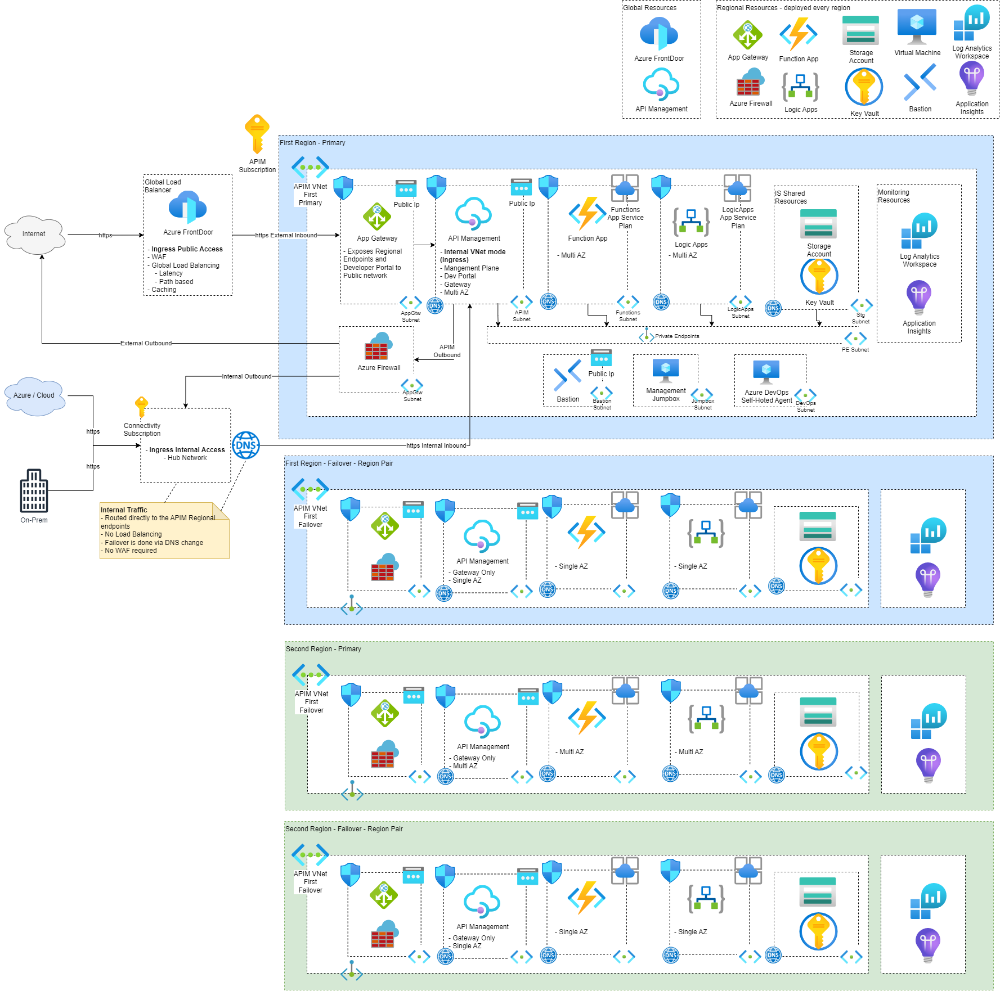
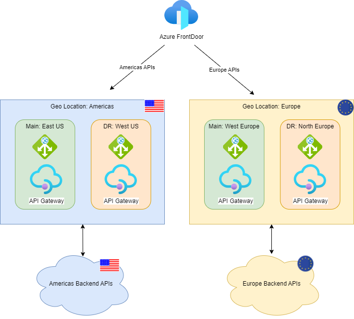
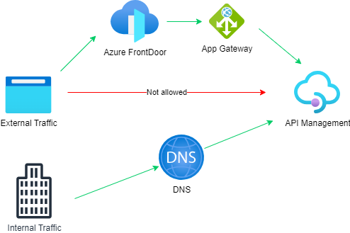

# ReliableAzureAPIM


## For today:
	Custom DNS & Msgs to Security!

# Architecture & Design Decisions

This repo is created on the top of APIM Landing Zone Accelerator, and most of the architectural decisions are following best practices of it.
The main differences / improvements are:
- All resources are Internal / VNet integrated - including Key Vault, Storage Accounts, Deployment Scripts, Azure Functions and Logic Apps.
- Uses a Multi-Region approach, with FrontDoor and Application Gateway.
- Global resources are deployed to the main region, and regional resources to the additional regions.
- Azure Firewall to protect APIM outbound traffic. 
- Availability Zones can be defined for all the resources.
- API Management endpoints have Custom DNS, so users can test the Developer Portal from APIM.

### Detailed Architecture
Full detail of the resources can be found [here](docs/ReferenceImplementation.md).



### All resources are Internal
Not only APIM is internal, but also Logic Apps, Functions, Storage and Key Vault - there are Private Endpoints for each of these services.
The reason for that is to keep all the traffic in the internal network, without having traffic via the public internet.
When you use APIM in External mode, APIM exposes the endpoints public, so the traffic goes via the public internet.

### Multi-Region deployment
This solution can be deployed to a Multi-Region environment. Not only APIM, but also the other Regional Resources.

### Have Main & Disaster Recovery region for each Geo Location
The solution consider that there are multiple Geo Locations (ex.: Americas and Europe), and each Geo Location contains 2 regions:  
**- Main Region:** This will the main region receiving all the requests for a specific Geo Location.  
**- Disaster Recovery Region:**  In case of a Regional disaster on Main region, this region will be used for Disaster Recovery.  
For reliability, all the Regional resources must be deployed on both regions.  



### Outbound Traffic from APIM goes via Azure Firewall
Outbound traffic from APIM goes via Azure Firewall to increase the security of the solution. This is implemented by adding UDR to the APIM Vnet -> Azure Firewall IP.

### Inbound Traffic
There are 2 different scenarios for Inbound traffic: Internal and External. These are described below.  



### External Inbound traffic - Global Load Balance & Disaster Recovery using FrontDoor
App Gateway is a Regional resource, so Frontdoor is the Global Loadbalancer.  
FrontDoor is able to do the Load Balance and also DR in case of Regional failure

### External Inbound Traffic to APIM goes via Regional Endpoints
I am not using the API Management Load Balancer because of the requirement that Consumers will also use specific Regional API Gateways.
With that requirement, App Gateway will only expose the Regional endpoints. For example:
- Sample gatewayRegionalUrl of main region (westeurope): 'https://{apim_name}-westeurope-01.regional.azure-api.net'
- Sample secondary region (germanywestcentral): 'https://{apim_name}-germanywestcentral-01.regional.azure-api.net'

### Internal Inbound traffic - Global Load Balance & Disaster Recovery using DNS
Internal Inbound traffic should remain private - so FrontDoor was not an option for that.  
As of today (Fev 2024) there isn't an Azure Global Load Balancer for Internal traffic with API Management, so there ins't a Load Balancer solution - also not a requirement for now.  
DNS is used for the Disaster Recovery in case of Regional failure.

### App Gateway x API Management x Certificates
When exposing the endpoints via App Gateway, you need to define a certificate for it. Here is the link for the documentation: https://learn.microsoft.com/en-us/azure/api-management/api-management-howto-integrate-internal-vnet-appgateway.  
When exposing the Developer Portal via App Gateway, APIM must have Custom Domains so the Developer Portal can point to the correct endpoints.
Below is the list of Certificates, App Gateway URLs (+routes) and Api Management Custom Domains:

- **Certificate**
  - Subject : CN=contoso-sandbox-apim.com
	- DNS Entries:
		- api.contoso-sandbox-apim.com
		- developer.contoso-sandbox-apim.com
		- management.contoso-sandbox-apim.com

- **App Gateway:**
  - Front End Urls:
    - api.contoso-sandbox-apim.com
      - Redirects to: {env}.azure-api.net
    - developer.contoso-sandbox-apim.com
      - Redirects to: {env}.developer.azure-api.net
    - management.contoso-sandbox-apim.com
      - Redirects to: {env}.management.azure-api.net

- **API Management:**
  - Original Urls:
    - {env}.azure-api.net
    - {env}.developer.azure-api.net
    - {env}.management.azure-api.net
  - Custom DNS Entries (****same as App Gateway Front End URLs):
    - api.contoso-sandbox-apim.com
    - developer.contoso-sandbox-apim.com
    - management.contoso-sandbox-apim.com

*** The API Management Custom DNS Entries are the same as the App Gateway FrontEnd URLs because when users are testing the APIs via the Developer Portal, the request is done via the Browser, so the request must follow this path:
  1) Browser connect to "api.contoso-sandbox-apim.com" via App Gateway
  2) App Gateway redirects the request to API Management using the original URL "{env}.azure-api.net"
  3) App Gateway uses the "{env}.azure-api.net" as source URL, so this URL must be added to the CORS "allow list" via a Global Policy

# To deploy and test the Architecture

### Option 1 - Deploy it using Bicep
1) Update the "main.dev.bicepparam" file with your configuration
```
Important! If you don't want to deploy a specific resource, then remove it from the "vNetSettings" for that specific region.
```
2) Create the "/testDeploy/secrets.ps1" file with the following information:
```
$env:DEVOPS_PAT="devops_pat"
$env:VMVMPASSWORD="your_vm_admin_password"
$env:SUBSCRIPTION_ID="you subscription id to deploy to"
```
3) Adjust variables on "/testDeploy/0_testpscript.ps1" script
4) Execute "/testDeploy/0_testpscript.ps1" script from the "/testDeploy/" folder

### Option 2 - Deploy it using Azure DevOps Pipeline
Azure DevOps pipeline: "pipeline.bicep.deploy.yml" - configuration described in the file.

### Testing with App Gateway

1) Add the App Gateway FQDN to your "hosts" file ( C:\Windows\system32\drivers\etc\hosts )
```
	{{App Gateway Public IP Address}} api.{{app gateway FQDN}}
	{{App Gateway Public IP Address}} devportalold.{{app gateway FQDN}}
	{{App Gateway Public IP Address}} devportal.{{app gateway FQDN}}
	{{App Gateway Public IP Address}} management.{{app gateway FQDN}}
```

2) Access the URLs directly from your browser
3) Use the "samplerequestapim.http" from VS Code to test the endpoints

# References

## APIM Landing Zone
	- https://github.com/Azure/apim-landing-zone-accelerator
	- https://github.com/Azure/Integration-Services-Landing-Zone-Accelerator 

## API Management Sample Bicep
	- https://github.com/Azure/azure-quickstart-templates/tree/bbe8c22070bf9c88f2e10ee8bf925ccd97c40a09/quickstarts/microsoft.apimanagement

	- https://github.com/Azure/azure-quickstart-templates/blob/bbe8c22070bf9c88f2e10ee8bf925ccd97c40a09/quickstarts/microsoft.apimanagement/api-management-key-vault-create/main.bicep#L86

	- https://learn.microsoft.com/en-us/samples/azure/azure-quickstart-templates/api-management-create-with-multiregion/
	- https://learn.microsoft.com/en-us/azure/api-management/api-management-howto-deploy-multi-region
	- https://github.com/nehalineogi/azure-cross-solution-network-architectures/blob/main/apim/README-mulitregion.md

	- https://github.com/kphan714/AzureDeploymentFramework/blob/2266fe9d37ac706c09027a9881583e5c23825533/ADF/bicep/APIM-APIM.bicep#L191
	

## APIM Management Custom Domain Name
	- https://github.com/azure/azure-quickstart-templates/tree/master/quickstarts/microsoft.web/private-webapp-with-app-gateway-and-apim

	- https://learn.microsoft.com/en-us/powershell/module/az.apimanagement/new-azapimanagementcustomhostnameconfiguration?view=azps-11.3.0 

	- https://github.com/MicrosoftDocs/azure-docs/blob/2a640210439fda7ee7d86f313f6e497cff7c9192/articles/api-management/api-management-howto-integrate-internal-vnet-appgateway.md

	- https://github.com/maikoldiaz/-fantastic-pancake/blob/58bee2dc7a13d13332baa9daa4ea1f956996516b/Deploy/Scripts/Bind-SSL-APIM.ps1#L17

	- https://github.com/MicrosoftDocs/azure-docs-powershell/blob/345438d814aa0d7a2969b42e9535709aeba88dc8/azps-10.4.1/Az.ApiManagement/Set-AzApiManagement.md?plain=1#L56

## App Gateway 
	- [(Use API Management in a virtual network with Azure Application Gateway - Azure API Management | Microsoft Learn)](https://learn.microsoft.com/en-us/azure/api-management/api-management-howto-integrate-internal-vnet-appgateway)
	- [Create Serf-service Certificate: Application Gateway with internal API Management and Web App - Code Samples | Microsoft Learn](https://learn.microsoft.com/en-us/samples/azure/azure-quickstart-templates/private-webapp-with-app-gateway-and-apim/)
	- [Sample Bicep: azure-quickstart-templates/quickstarts/microsoft.web/private-webapp-with-app-gateway-and-apim at master · Azure/azure-quickstart-templates (github.com)](https://github.com/Azure/azure-quickstart-templates/tree/master/quickstarts/microsoft.web/private-webapp-with-app-gateway-and-apim)
	- [Generate self-signed certificate with a custom root CA - Azure Application Gateway | Microsoft Learn](https://learn.microsoft.com/en-us/azure/application-gateway/self-signed-certificates)
	- [Tutorial: Create and configure an application gateway to host multiple web sites using the Azure portal - Azure Application Gateway | Microsoft Learn](https://learn.microsoft.com/en-us/azure/application-gateway/create-multiple-sites-portal)

	- App Gateway + LogAnalytics sample: https://github.com/AzDocs/AzDocs/blob/11872387c6674d1c09b90902195023b965468ab9/src-bicep/Network/applicationGateways.bicep#L8

	- To solve error "The remote server returned an error: (403) Forbidden.'. Please check if the storage account is accessible" - https://stackoverflow.com/questions/69766994/cant-create-a-file-share-in-a-storage-account-while-deploying-logic-app-from-th

	- https://learn.microsoft.com/en-us/answers/questions/1006626/application-gateway-backend-end-pool-not-getting-u

		- stop: az network application-gateway stop -n appgw-rmor2-dev-westeurope-001 -g rg-apim-rmor2-dev-westeurope-001
		- start: az network application-gateway start -n appgw-rmo3-dev-uksouth-001 -g rg-apim-rmo3-dev-uksouth-001


## Firewall
	- https://techcommunity.microsoft.com/t5/azure-paas-blog/api-management-networking-faqs-demystifying-series-ii/ba-p/1502056
	- Look for "Force tunneling": https://learn.microsoft.com/en-us/azure/api-management/api-management-using-with-internal-vnet?tabs=stv2
	- https://github.com/nehalineogi/azure-cross-solution-network-architectures/blob/main/apim/README-firewall.md
	- https://learn.microsoft.com/en-us/azure/app-service/network-secure-outbound-traffic-azure-firewall
	- Error: "Put on Firewall Policy Failed with 1 faulted referenced firewalls"  https://cloudcurve.co.uk/azure/azure-firewall-policy-fix-failed-provisioning-state/

	Firewall: [API Management - Networking FAQs (Demystifying Series II) - Microsoft Community Hub](https://techcommunity.microsoft.com/t5/azure-paas-blog/api-management-networking-faqs-demystifying-series-ii/ba-p/1502056#b1)
		https://learn.microsoft.com/en-us/azure/app-service/network-secure-outbound-traffic-azure-firewall
			Subnet address range, accept the default or specify a range that's at least /26 in size.
	- Create UDR like this to route all Internet Traffic to Firewall and Allow APIM to connect internally:

		| Name                  | Address prefix | Next hop type   | Next hop IP address |
		|-----------------------|----------------|-----------------|---------------------|
		| route-apim-to-firewall | 0.0.0.0/0      | VirtualAppliance | 10.2.8.4 (FW private ID)          |
		| fw-apim               | ApiManagement  | Internet        |                     |

## Azure Functions

	- https://learn.microsoft.com/en-us/azure/azure-functions/configure-networking-how-to?tabs=portal
	- https://learn.microsoft.com/en-us/azure/azure-functions/functions-create-vnet
	- Sample Function HTTP trigger: https://github.com/Azure-Samples/functions-vnet-tutorial

## Logic Apps
	- https://www.middleway.eu/deployment-of-standard-logic-app-via-bicep/
	- https://techcommunity.microsoft.com/t5/azure-integration-services-blog/deploying-logic-app-standard-resource-using-bicep-templates-and/ba-p/3760070
	- https://learn.microsoft.com/en-us/azure/logic-apps/single-tenant-overview-compare
	- https://jordanbeandev.com/how-to-deploy-logic-apps-standard-with-bicep-azure-devops/
	- https://learn.microsoft.com/en-us/azure/logic-apps/set-up-devops-deployment-single-tenant-azure-logic-apps?tabs=github

## DevOps
	- https://github.com/mattias-fjellstrom/azure-bicep-upload-data-to-storage/blob/main/main.bicep
	- https://learn.microsoft.com/en-us/azure/virtual-machines/extensions/features-windows
	- https://learn.microsoft.com/en-us/azure/virtual-machines/extensions/custom-script-windows
	- https://learn.microsoft.com/en-us/azure/virtual-machines/extensions/troubleshoot

## Key Vault
	- https://github.com/Azure/azure-quickstart-templates/blob/master/quickstarts/microsoft.keyvault/key-vault-create-rbac/main.bicep

## Deployment Script
	- https://johnlokerse.dev/2022/12/04/run-powershell-scripts-with-azure-bicep/

## Migration of APIM to Stv2 
	- [Azure-Orbital-STAC/deploy/bicep/modules/apim.bicep at 105c1af9c0b5d4749c4c94fa059fdf84b6f2c811 · Azure/Azure-Orbital-STAC (github.com)](https://github.com/Azure/Azure-Orbital-STAC/blob/105c1af9c0b5d4749c4c94fa059fdf84b6f2c811/deploy/bicep/modules/apim.bicep#L67)

	- Have the Public IP set on APIM!

## Public IP Address
	- https://learn.microsoft.com/en-us/security/benchmark/azure/baselines/azure-public-ip-security-baseline

## Managed Identities
	- https://learn.microsoft.com/en-us/entra/identity/managed-identities-azure-resources/managed-identities-faq

## DevOps & API Ops
	- https://azure.github.io/apiops/
	- https://learn.microsoft.com/en-us/azure/api-management/devops-api-development-templates
	- https://medium.com/version-1/shared-azure-api-management-service-design-f0a6f0e12bd8
	- https://www.youtube.com/watch?v=8ZIt_DlNCoo

## Developer Portal
	- https://learn.microsoft.com/en-us/azure/api-management/automate-portal-deployments

## Entra ID for Authententication:
	- Developer Portal with Entra ID Authtentication: https://learn.microsoft.com/en-us/azure/api-management/api-management-howto-aad?WT.mc_id=Portal-fx

## Monitoring
	- https://techcommunity.microsoft.com/t5/fasttrack-for-azure/end-to-end-logging-with-azure-front-door-application-gateway-and/ba-p/3673671

## OAuth 2.0
	- https://learn.microsoft.com/en-us/azure/api-management/api-management-howto-oauth2 
	- https://learn.microsoft.com/en-us/azure/api-management/api-management-howto-protect-backend-with-aad
	- https://techcommunity.microsoft.com/t5/azure-paas-blog/protect-api-s-using-oauth-2-0-in-apim/ba-p/2309538
	- https://azure.github.io/apim-lab/apim-lab/7-security/security-7-2-1-oauth2-apim-integration.html
	- https://medium.com/@gulshan.bajaj/how-to-implement-oauth2-0-for-an-api-in-azure-apim-e2cdba4ff2ba

## APIM Developer Portal Customizations
	- https://learn.microsoft.com/en-us/azure/api-management/api-management-howto-developer-portal-customize

## Frontdoor
	- https://github.com/Azure/azure-quickstart-templates/tree/master/quickstarts/microsoft.cdn/front-door-standard-premium-application-gateway-public

# Others

## To manually publish the Developer Portal:
		1) Go to the Portal via APIM: Developer portal-> Portal overview
		2) Click on "Developer Portal" link on the top of the page
		3) Adjust the url to the App Gateway url
		4) Login and open the Portal
		5) From the Developer Portal, click on "Operations" -> "Publish"

## To Export / Import Developer Portal styling
- Pre-Reg:
```
git clone https://github.com/Azure/api-management-developer-portal.git
cd api-management-developer-portal
npm install
cd scripts.v3
```
- To export: 
```
az login
az account set --subscription afb8f550-216d-4848-b6f1-73b1bbf58f1e
node ./capture --subscriptionId afb8f550-216d-4848-b6f1-73b1bbf58f1e --resourceGroupName rg-name --serviceName apimservicename
```
- To import: 
```
az login
az account set --subscription 2d172aeb-b927-43ec-9808-8c9585119364
node ./generate --subscriptionId 2d172aeb-b927-43ec-9808-8c9585119364 --resourceGroupName rg-apim-hkdi2-dev-westeurope-001 --serviceName apima-hkdi2-dev-westeurope-001 --publish true
```

## To test with Developer Portal and Self-Service certificates
	If you are receiving "CORS" errors when trying to test using Developer Portal, it could be because:  

	1) CORS is not enabled - to fix you need to so enable it
	2) The Certificate is not valid / insecure - try to open the URL with the API call url in a browser window, and accept / trust the certificate  

	After these, you should be able to test the APIs using Developer Portal with Self-signed certificates
	

## How to Test APIs from Azure Portal APIM
	1) Login to the Jumpbox using Bastion and login to Azure Portal
	2) Open the API Operation you would like to test
	3) On the "Host" field, select the original endpoint from the API Gateway
	4) Check the "Bypass CORS proxy" checkbox
	5) Send the request

## Role Assignment for Key Vault to a specific User - PowerShell Script
This can be handy to debug / test certificates
```
$USER_OBJECT_ID = "xxxxxx-xxxxxxxx-xxxxxxxxx-xxxxxx"
$KV_RESOURCE_ID = "/subscriptions/xxxxxxxxxxxxx/resourceGroups/xxxxxxxxxxx/providers/Microsoft.KeyVault/vaults/xxxxxxxxx"

az role assignment create --assignee-object-id $USER_OBJECT_ID --assignee-principal-type User `
--role "Key Vault Certificates Officer" `
--scope $KV_RESOURCE_ID

az role assignment create --assignee-object-id $USER_OBJECT_ID --assignee-principal-type User `
--role "Key Vault Secrets User" `
--scope $KV_RESOURCE_ID
```