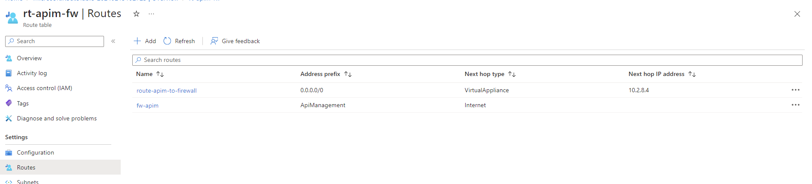

# ReliableAzureAPIM


## For today:
	
	Dependencies:
		- Request my account 
		- Azure DevOps Project
			- Service Connections

		- Backlog
		- Prod and Non-Project Subscriptions

	Things I can work on:
		- Deploy Sandbox
			- Issue with:
				- Bastion and Firewall

		- Conversation with Duncan / Reinier on Security
			- Prepare the Questions - Firewall, Public IPs, NSGs, SIEM monitoring

		- Prepare scripts for Heineken

		- Documentation
			- Document the scripts
			- Architecture documents

		- Continue for the Multi Region

		- Deep dive into the other requirements:
			 Security,  Networking & Resilience

		- Paired regions 

	Explain Multi-Region x Region Pair

	API Center

	Outbound goes via Firewall

	API Ops: https://azure.github.io/apiops/
		- Check! 
			Documentation
			Compliancy
			Others?

	Developer Portal Styling

	Logic Apps - DevOps flow
	
	Functions - test the flow (Deploy to the External Subscription)
		Low prio - but to explain why this is not there

	Low Prio Improvements:
		Check if Only on Subnet is Ok for all the Private Endpoints
		Move things to the correct Resource Groups
		Private endpoint for the API Management - what are the timelines?

# Architecture & Design Decisions

This repo is created on the top of APIM Landing Zone Accelerator, and most of the architectural decisions are following best practices of it.
There are few improvements / changes to the discussed below.

## All resources are Internal
Not only APIM is internal, but also Logic Apps, Functions, Storage and Key Vault - there are Private Endpoints for each of these services.

## Multi-Region deployment
This solution can be deployed to a Multi-Region environment. Not only APIM, but also the other Regional Resources.

## Outbound Traffic from APIM goes via Azure Firewall
Outbound traffic from APIM goes via Azure Firewall to increase the security of the solution.

# To deploy and test the Architecture

## Option 1 - Deploy it using Bicep
1) Update the "main.dev.bicepparam" file with your configuration
2) If you are deploying DevOps Agent and JumpBox VM, create the "/testDeploy/secrets.ps1" file with the following information:
```
$env:DEVOPS_PAT="devops_pat"
$env:VMVMPASSWORD="your_vm_admin_password"
```
3) Adjust variables on "/testDeploy/0_testpscript.ps1" script
4) Execute "/testDeploy/0_testpscript.ps1" script from the "/testDeploy/" folder

## Option 2 - Deploy it using Azure DevOps Pipeline
Azure DevOps pipeline: "pipeline.bicep.deploy.yml" - configuration described in the file.

## Testing with App Gateway

1) Add the App Gateway FQDN to your "hosts" file ( C:\Windows\system32\drivers\etc\hosts )
```
	{{App Gateway Public IP Address}} api.{{app gateway FQDN}}
	{{App Gateway Public IP Address}} devportalold.{{app gateway FQDN}}
	{{App Gateway Public IP Address}} devportal.{{app gateway FQDN}}
	{{App Gateway Public IP Address}} management.{{app gateway FQDN}}
```

2) Access the URLs directly from your browser
3) Use the "samplerequestapim.http" from VS Code to test the endpoints

# References

## APIM Landing Zone
	- https://github.com/Azure/apim-landing-zone-accelerator
	- https://github.com/Azure/Integration-Services-Landing-Zone-Accelerator 


## App Gateway 
	- [(Use API Management in a virtual network with Azure Application Gateway - Azure API Management | Microsoft Learn)](https://learn.microsoft.com/en-us/azure/api-management/api-management-howto-integrate-internal-vnet-appgateway)
	- [Create Serf-service Certificate: Application Gateway with internal API Management and Web App - Code Samples | Microsoft Learn](https://learn.microsoft.com/en-us/samples/azure/azure-quickstart-templates/private-webapp-with-app-gateway-and-apim/)
	- [Sample Bicep: azure-quickstart-templates/quickstarts/microsoft.web/private-webapp-with-app-gateway-and-apim at master · Azure/azure-quickstart-templates (github.com)](https://github.com/Azure/azure-quickstart-templates/tree/master/quickstarts/microsoft.web/private-webapp-with-app-gateway-and-apim)
	- [Generate self-signed certificate with a custom root CA - Azure Application Gateway | Microsoft Learn](https://learn.microsoft.com/en-us/azure/application-gateway/self-signed-certificates)
	- [Tutorial: Create and configure an application gateway to host multiple web sites using the Azure portal - Azure Application Gateway | Microsoft Learn](https://learn.microsoft.com/en-us/azure/application-gateway/create-multiple-sites-portal)

	- App Gateway + LogAnalytics sample: https://github.com/AzDocs/AzDocs/blob/11872387c6674d1c09b90902195023b965468ab9/src-bicep/Network/applicationGateways.bicep#L8

	- To solve error "The remote server returned an error: (403) Forbidden.'. Please check if the storage account is accessible" - https://stackoverflow.com/questions/69766994/cant-create-a-file-share-in-a-storage-account-while-deploying-logic-app-from-th

	- https://learn.microsoft.com/en-us/answers/questions/1006626/application-gateway-backend-end-pool-not-getting-u

		- stop: az network application-gateway stop -n appgw-rmor2-dev-westeurope-001 -g rg-apim-rmor2-dev-westeurope-001
		- start: az network application-gateway start -n appgw-rmor4-dev-uksouth-001 -g rg-apim-rmor4-dev-uksouth-001


## Firewall
	- https://techcommunity.microsoft.com/t5/azure-paas-blog/api-management-networking-faqs-demystifying-series-ii/ba-p/1502056
	- Look for "Force tunneling": https://learn.microsoft.com/en-us/azure/api-management/api-management-using-with-internal-vnet?tabs=stv2
	- https://github.com/nehalineogi/azure-cross-solution-network-architectures/blob/main/apim/README-firewall.md
	- https://learn.microsoft.com/en-us/azure/app-service/network-secure-outbound-traffic-azure-firewall
	- Error: "Put on Firewall Policy Failed with 1 faulted referenced firewalls"  https://cloudcurve.co.uk/azure/azure-firewall-policy-fix-failed-provisioning-state/

	Firewall: [API Management - Networking FAQs (Demystifying Series II) - Microsoft Community Hub](https://techcommunity.microsoft.com/t5/azure-paas-blog/api-management-networking-faqs-demystifying-series-ii/ba-p/1502056#b1)
		https://learn.microsoft.com/en-us/azure/app-service/network-secure-outbound-traffic-azure-firewall
			Subnet address range, accept the default or specify a range that's at least /26 in size.
	- Create UDR like this to route all Internet Traffic to Firewall and Allow APIM to connect internally:

		| Name                  | Address prefix | Next hop type   | Next hop IP address |
		|-----------------------|----------------|-----------------|---------------------|
		| route-apim-to-firewall | 0.0.0.0/0      | VirtualAppliance | 10.2.8.4 (FW private ID)          |
		| fw-apim               | ApiManagement  | Internet        |                     |
		



## Azure Functions

	- https://learn.microsoft.com/en-us/azure/azure-functions/configure-networking-how-to?tabs=portal
	- https://learn.microsoft.com/en-us/azure/azure-functions/functions-create-vnet
	- Sample Function HTTP trigger: https://github.com/Azure-Samples/functions-vnet-tutorial

## Logic Apps
	- https://www.middleway.eu/deployment-of-standard-logic-app-via-bicep/
	- https://techcommunity.microsoft.com/t5/azure-integration-services-blog/deploying-logic-app-standard-resource-using-bicep-templates-and/ba-p/3760070
	- https://learn.microsoft.com/en-us/azure/logic-apps/single-tenant-overview-compare
	- https://jordanbeandev.com/how-to-deploy-logic-apps-standard-with-bicep-azure-devops/
	- https://learn.microsoft.com/en-us/azure/logic-apps/set-up-devops-deployment-single-tenant-azure-logic-apps?tabs=github

## DevOps
	- https://github.com/mattias-fjellstrom/azure-bicep-upload-data-to-storage/blob/main/main.bicep
	- https://learn.microsoft.com/en-us/azure/virtual-machines/extensions/features-windows
	- https://learn.microsoft.com/en-us/azure/virtual-machines/extensions/custom-script-windows
	- https://learn.microsoft.com/en-us/azure/virtual-machines/extensions/troubleshoot

## Key Vault
	- https://github.com/Azure/azure-quickstart-templates/blob/master/quickstarts/microsoft.keyvault/key-vault-create-rbac/main.bicep

## Deployment Script
	- https://johnlokerse.dev/2022/12/04/run-powershell-scripts-with-azure-bicep/

## Multi Region
	- https://learn.microsoft.com/en-us/samples/azure/azure-quickstart-templates/api-management-create-with-multiregion/
	- https://learn.microsoft.com/en-us/azure/api-management/api-management-howto-deploy-multi-region
	- https://github.com/nehalineogi/azure-cross-solution-network-architectures/blob/main/apim/README-mulitregion.md

## Migration of APIM to Stv2 
	- [Azure-Orbital-STAC/deploy/bicep/modules/apim.bicep at 105c1af9c0b5d4749c4c94fa059fdf84b6f2c811 · Azure/Azure-Orbital-STAC (github.com)](https://github.com/Azure/Azure-Orbital-STAC/blob/105c1af9c0b5d4749c4c94fa059fdf84b6f2c811/deploy/bicep/modules/apim.bicep#L67)

	- Have the Public IP set on APIM!

# Others

## To publish the Developer Portal:
		1) Go to the Portal via APIM: Developer portal-> Portal overview
		2) Click on "Developer Portal" link on the top of the page
		3) Adjust the url to the App Gateway url
		4) Login and open the Portal
		5) From the Developer Portal, click on "Operations" -> "Publish"
