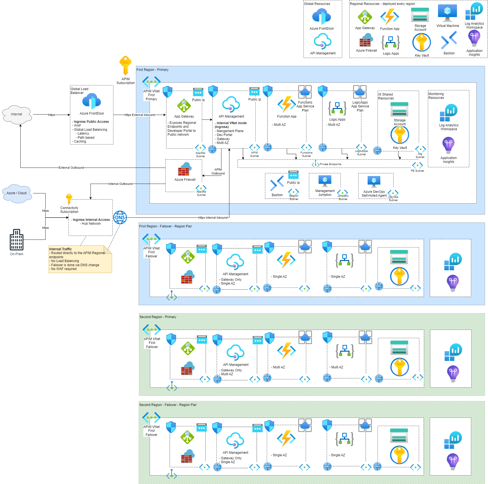

# Reference Implementation
This is a detailed list of all resources deployed by the Bicep templates. Changes on the Architecture and Bicep templates should be reflected here.

# Resources per Resource Group
## RG-APIM: API Management Core Services
**API Management:** API Management using Internal Mode (no public access) - Global Resource with API Gateway deployed to Multiple Regions  
**API Management Managed Identity:** API Management identity to interact with other services  
**App Gateway:** Expose publically API Management endpoints - Regional resource deployed to all regions  
**App Gateway Public IP Address:** Public IP address of App Gatweway - Regional resource deployed to all regions  

## RG-NETWORKING: Networking Resources
**Virtual Nework & Subnets:** Virtual Network for the APIM solution. It has an Address space of /16 - Regional resouce deployed to all regions.  Contains the following Subnets, UDRs and Service Endpoints:
* API Management Outbound Subnet /24
    * Service Endpoints: Microsoft.Storage, Microsoft.Sql, Microsoft.EventHub, Microsoft.KeyVault
    * UDR: From APIM Outbound to Azure Firewall Inbound
        * route-internet-apim-subnet-to-firewall: Route all traffic to Azure Firewall
            * addressPrefix: '0.0.0.0/0'
            * nextHopType: 'VirtualAppliance'
            * nextHopIpAddress: {Azure Firewall Private IP Address}
        * route-apim-to-internet: Route APIM Management traffic to the Internet - this is required for management purposes
            * addressPrefix: 'ApiManagement'
            * nextHopType: 'Internet'
* Application Gateway Subnet /24
* Functions Inbound Subnet /24
* Functions Outbound Subnet /24
* Logic Apps Inbound Subnet /24
* Logic Apps Outbound Subnet /24
* Storage Account (Logic Apps) Inbound Subnet /24
* Azure Firewall Subnet /24
* JumpBox Subnet /24
* Bastion (JumpBox) Subnet /24
* DevOps Self-Hosted Agent Subnet /24

**NSGs:** There is an NSG defined for each of the Subnets. Check the "networking.bicep" to view the definitions. Most of the rules are required due to filter traffic to and from your API Management instance. Documentation can also be found here: [APIM Internal NSG Rules](https://learn.microsoft.com/en-us/azure/api-management/api-management-using-with-internal-vnet?tabs=stv2#configure-nsg-rules)  
**Bastion:** Bastion to safely connect to the JumpBox - Regional resource, only deployed to main region.  
**APIM Private DNS Zones:** Manages and resolves APIM domain names in the virtual network to point to the APIM private IP addresses - Regional resource deployed to all regions. List below:
* azure-api.net: API Gateway
* management.azure-api.net: Direct Management 
* developer.azure-api.net: Developer Portal
* portal.azure-api.net: Deprecated Developer Portal

**Public IP Addresses:** these are required for the different servicers. List below:
* APIM Public IP Address: Used only for control plane traffic to the management endpoint over port 3443. Can be locked down to the ApiManagement service tag. Regional resource only deployed to main region.
* Bastion Public IP Address: connect to Bastion. Regional resource only deployed to main region.
* Azure Firewall Public IP Address: required for Azure Firewall - Regional resource only deployed to all regions.

**Azure Firewall:** firewall to protect outbound traffic from APIM - Regional service deployed to all regions.  
**Azure Firewall Policy:** defines the firewall rules to block / allow specific traffic. Currently this is allowing all outbound connectivity on HTTP/HTTPS.  

## RG-SHARED: Shared Resources
**Azure DevOps Self-Hosted Agent Virtual Machine:** this is injected into the VNet, and is required to deploy code to APIM, Azure Functionas and Logic Apps - as all the services are Internal and cannot be accessed from Internet - Regional resource deployed only on main region.  
**JumpBox Virtual Machine:** this is injected into the VNet, and is required to the resources directly from the VNet as all the services are Internal and cannot be accessed from Internet - Regional resource deployed only on main region.  
**Log Analytics Workspace:** store logs and metrics from the different services. Regional resource deployed in all regions.  
**Application Insights:** Monitoring tool for API Management and other services. Regional resource deployed in all regions.  
**Key Vault:** store secrets and certificates - Regional resource deployed in all regions.  
**Deployment Script: Self Signed Certificate:** create the self signed certificate - should only be used for Development environment.  

## RG-Backend Logic App: Logic App resources
**Logic App (Standard):** logic app vnet injected / restricted both inbound and outboud. Regional resource - to be deployed every region.  
**App Service Plan:** app service plan for the Logic App. Regional resource - to be deployed every region.  
**Storage Account - Logic App:** storage account required for the Logic App, access is also restricted to the Vnet only. Regional resource - to be deployed every region.  
**Private DNS Zones - Logic App & Storage:** Manages and resolves Logic App & Storage domain names in the virtual network to point to the Logic App & Storage private IP addresses - Regional resource deployed to all regions. List below:
* privatelink.azurewebsites.net: Logic App inbound access
* privatelink.blob.core.windows.net: Storage blob inbound access
* privatelink.file.core.windows.net: Storage file inbound access
* privatelink.queue.core.windows.net: Storage queue inbound access
* privatelink.table.core.windows.net: Storage table inbound access

**Private Endpoints:** used to secure the endpoints of the Logic Apps and Storage keeping them in the internal network (private access). [Private Endpoints](https://learn.microsoft.com/en-us/azure/private-link/private-endpoint-overview). There's one private endpoint for each of the Private DNS Zone entries. It uses the Private DNS Zone to point to the correct resource / domain name / ip address - Regional resource deployed to all regions.  